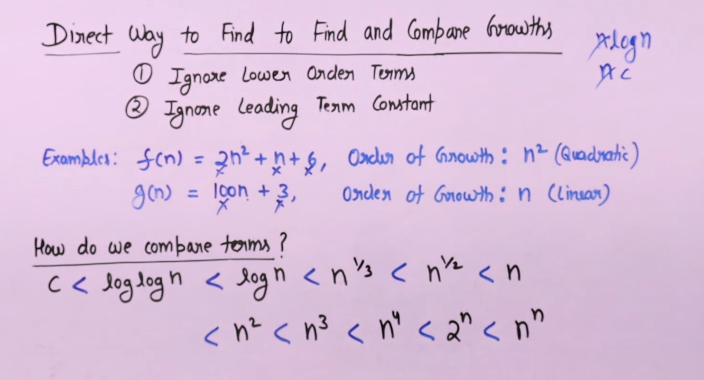
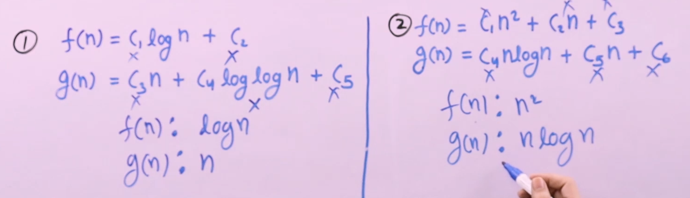
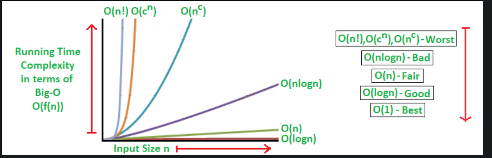
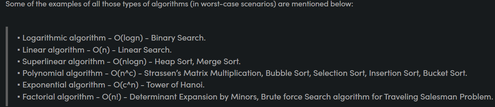
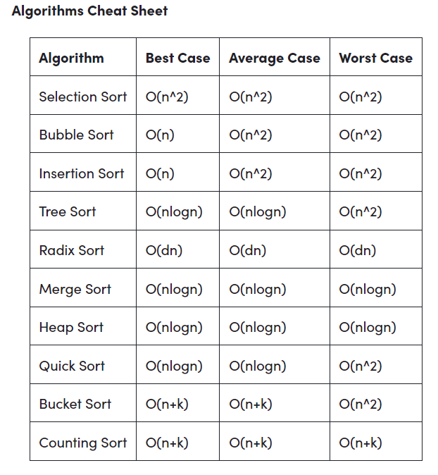

- <h1>Asymptotic Analysis</h1>

Here time taken by an algorithm is in increasing order.

In the example 1 - g(n) take more time hence bad algorithm.

- ### Big O
-> Exact or upperbound, when we know exact notation we would write in `theta notation` not in `Big O`.  
-> Works for the multiple variable also. 
-> Logarithmic Function: If f(n) = logan and g(n)=logbn, then O(f(n))=O(g(n)); all log functions grow in the same manner in terms of Big-O.

